# Zuken Design Automator

This tool can transform simple Excel configurations into fully automated, professional technical drawings in Zuken, saving engineers hours of manual work.
It lets you programmatically:
- place components
- create connections
- set line width and color
- add text fields
- set location and assignment
- add wires and wire names
- name components
- save zuken projects and generate pdfs

## Example Project

With a simple click, change your project Configuration in Excel to create a multitude of technical drawings in Zuken e3
| Image 1 | Image 2 |
| ------- | ------- |
| 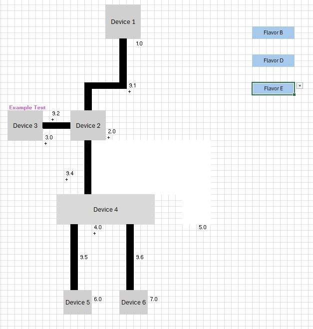 | 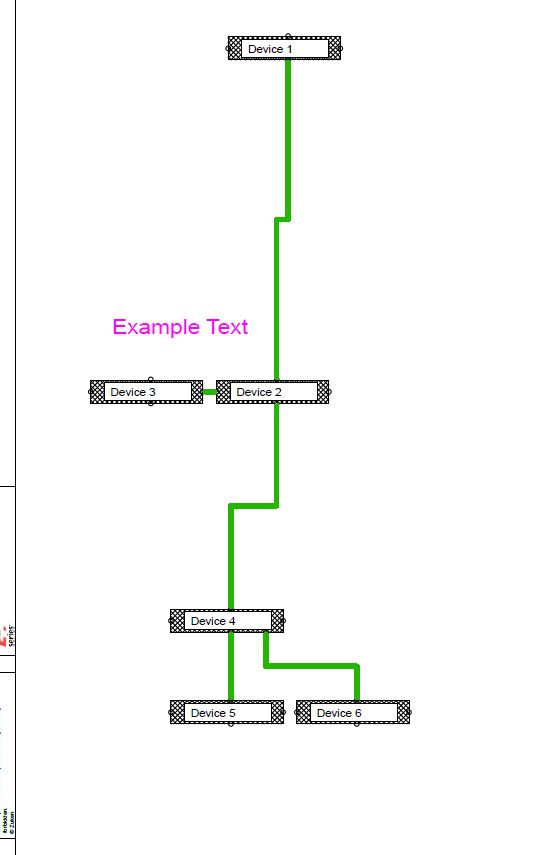 |
| 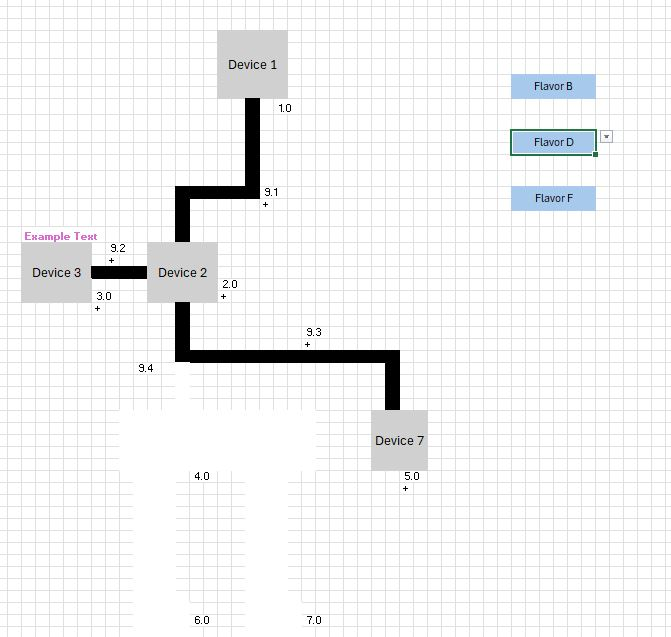 | 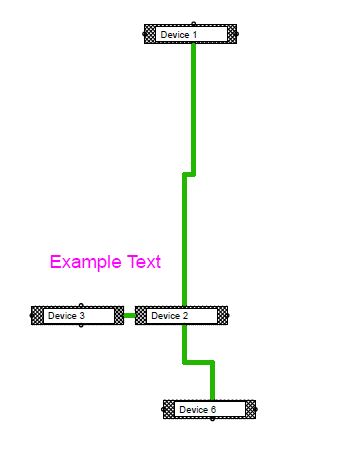 |
| 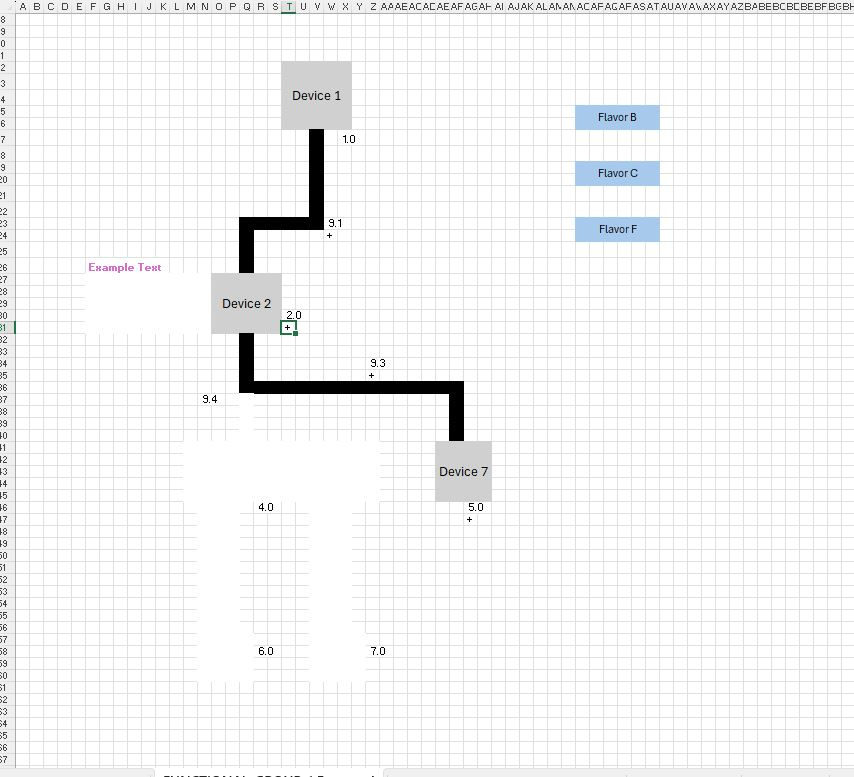 | 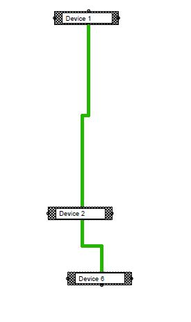 |
| |  |
| 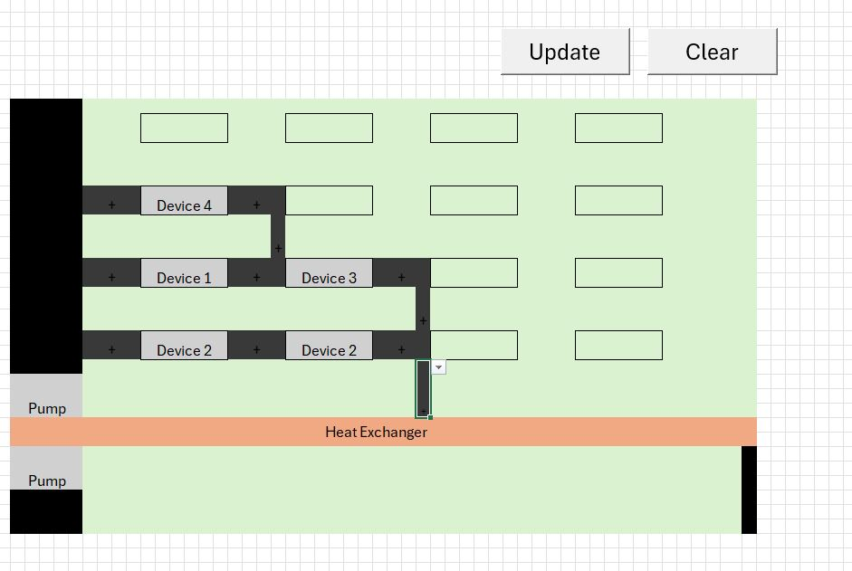 | 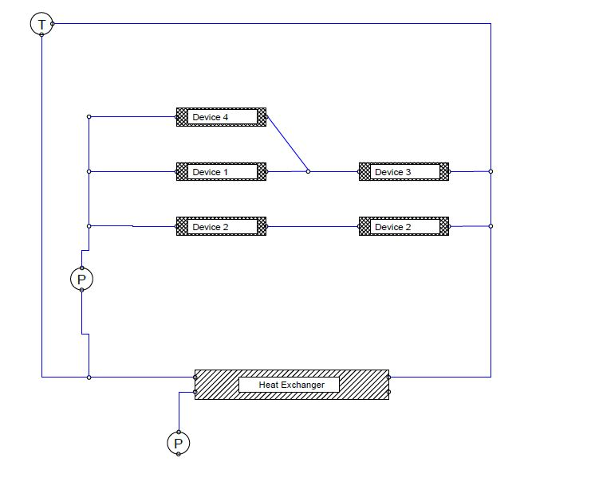 |
| 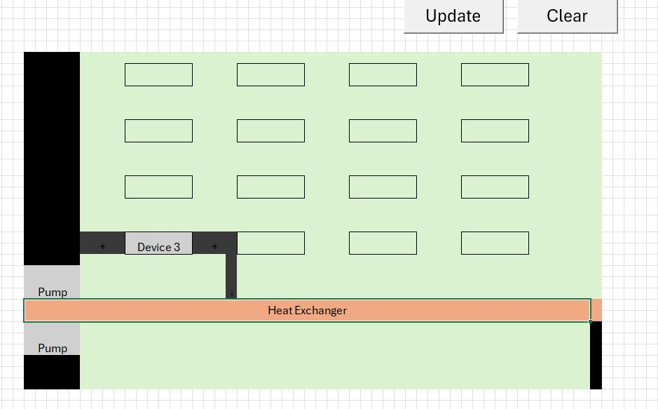 | 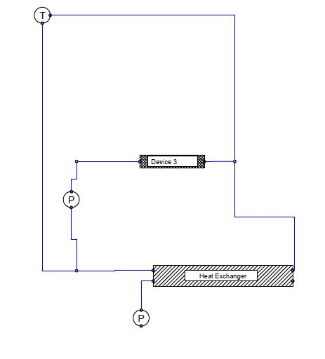 |
| 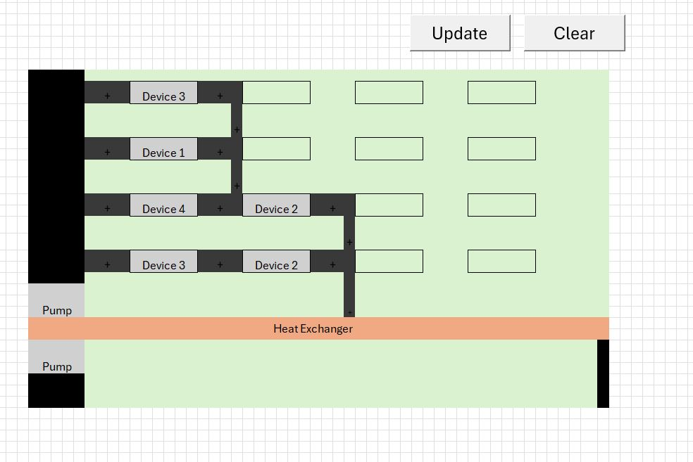 | 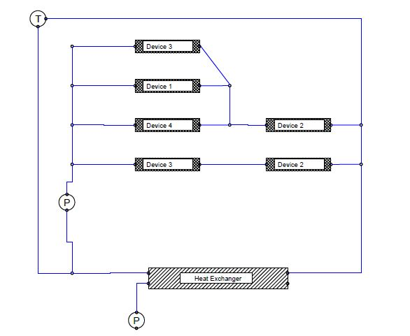 |

Open project_configs/project_planning_template.xlsm and change configurations in the ..frontend tables
Open zuken_templates/empty.e3s in a new Zuken Instance
in the "Run" Table click the Run button to generate the project

---

## Customize the tool to your needs:
Read the documentation in the "Readme" Table inside the project_configs/project_planning_template.xlsm file

